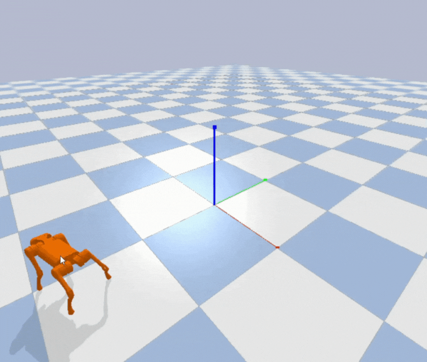

# Quadruped Fall Recovery with Deep Reinforcement Learning

This repository contains the official code and simulation environment for the paper [Self-Recovery of Quadrupedal Robot Using Deep Reinforcement Learning](https://doi.org/10.1109/RAAI64504.2024.10949561)

This work proposes a **DRL-based self-recovery controller** for the Unitree A1 robot using **Proximal Policy Optimization (PPO)**. The policy learns to recover from arbitrary fallen states **without any predefined kinematic motion patterns or inverse kinematics**.




## Repository Structure

```bash
quad-fall-recovery-rl/
│
├── quad/
│   ├── __init__.py
│   ├── envs/
│   │   ├── __init__.py
│   │   ├── quad_env.py
│   │   ├── reward.py
│   │   └── utils.py
│   │
│   └── data/
├── config.py
├── train.py
├── test.py

```

## Quick Start

### 1-Train the RL model
```bash
python train.py
```
Configure hyperparameters in config.py.

### 2-Test the trained policy
```bash
python test.py
```

##  Citation
If you use this repository, please cite:

> **Self-Recovery of Quadrupedal Robot Using Deep Reinforcement Learning**  
> *Yusuf Eren Kılıç, Yunus Emre Akar, Hakan Temeltaş, Ecem Sümer*  
> 2024 4th International Conference on Robotics, Automation and Artificial Intelligence (RAAI)  
> DOI: 10.1109/RAAI64504.2024.10949561
